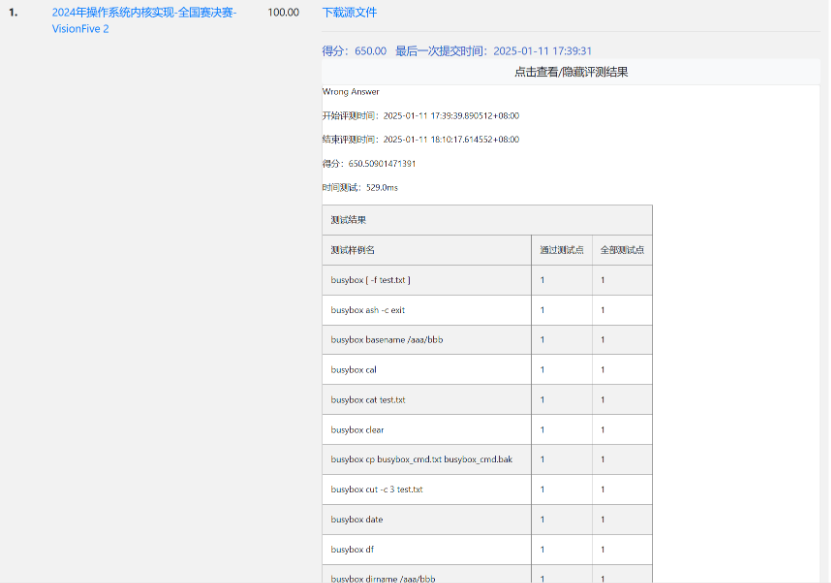

# 2025.1.21

## 系统调用初步分析（基于starry-old）

### SHMGET

- 功能：创建或获取一个共享内存段。
- 参数：
    - `key` - i32：共享内存段的键值，用于标识共享内存段。
    - `size` - usize：共享内存段的大小。
    - `flags` - i32：标志，用于设置共享内存段的权限和其他属性。
- 返回值：成功时返回共享内存段的标识符，失败时返回-1并设置errno。
    - 创建或者获取成功是返回共享内存的id
    - 重复创建返回EEXIST错误
    - 未获取到且flag中未设置创建标志返回ENOENT错误
    - 其他情况返回EINVAL错误
- 测例：busybox
    - https://github.com/Starry-OS/testcases/blob/main/x86_64_linux_musl/busybox

### SHMCTL（starry-old未直接实现）

- 功能：控制共享内存段的属性，如删除、改变权限等。
- 参数：
    - `shmid` - i32：共享内存段的标识符。
    - 'cmd' - i32：命令，如 IPC_RMID（删除共享内存段）、IPC_SET（设置共享内存段的权限）等。
    - `buf` - usize：指向 struct shmid_ds 的指针，用于传递或接收共享内存段的属性。
- 返回值：
    - 如成功返回0，错误返回对应错误码
- 测例：busybox
    - https://github.com/Starry-OS/testcases/blob/main/x86_64_linux_musl/busybox

### SHMAT

- 功能：将共享内存段附加到调用进程的地址空间。
- 参数：
    - `shmid` - i32：共享内存段的标识符。
    - `addr` - usize：指定附加地址，通常为NULL，表示由系统自动选择。
    - `flags` - i32：标志，如SHM_RND（将shmaddr向下舍入到最近的页面边界）等。
- 返回值：
    - 成功时返回附加地址
    - addr=0且无空余内存区域返回ENOMEM错误
    - 其他返回ENOVAL错误
- 测例：busybox
    - https://github.com/Starry-OS/testcases/blob/main/x86_64_linux_musl/busybox

### BRK
- 功能：修改用户堆大小（重新设置堆顶地址）。
- 参数：
    - `brk` - usize：新的堆顶地址。
- 返回值：
    - 如输入 brk 为 0 ，则返回堆顶地址
    - 如成功则返回设置后的堆顶地址，否则保持不变，并返回之前的堆顶地址
- 测例：
    - https://github.com/oscomp/testsuits-for-oskernel/blob/pre-2024/riscv-syscalls-testing/user/src/oscomp/brk.c

### MUNMAP

- 功能：取消映射
- 参数：
    - `start` - usize：开始取消的地址
    - `len` - usize：取消的长度
- 返回值：
    - 如成功返回0
- 测例：
    - https://github.com/oscomp/testsuits-for-oskernel/blob/pre-2024/riscv-syscalls-testing/user/src/oscomp/munmap.c

### MREMAP

- 功能：重新映射内存区域。
- 参数：
    - `old_addr` - usize：旧的内存区域的起始地址。
    - `old_size` - usize：旧的内存区域的大小。
    - `new_size` - usize：新的内存区域的大小。
    - `flags` - usize：标志，如MREMAP_MAYMOVE（允许移动内存区域）等。
    - `new_addr` - usize：新的内存区域的起始地址。
- 返回值：
    - 成功且新大小小于旧的大小，返回旧的起始地址（不需要移动）
    - 成功且新大小大于旧的大小，返回新的起始地址（需要移动）
    - 错误返回EINVAL
- 说明：mremap用于调整已映射内存区域的大小，如果需要，可以移动内存区域。
- 测例：busybox
    - https://github.com/Starry-OS/testcases/blob/main/x86_64_linux_musl/busybox

### MMAP

- 功能：将文件内容映射到内存中
- 参数：
    - `start` - usize：映射开始地址
    - `len` - usize：指定了映射文件的长度
    - `prot` - MMAPPROT：指定了页面的权限
    - `flags` - MMAPFlags：指定了映射的方法
    - `fd` - i32：文件描述符
    - `offset` - usize：指定了从文件区域中的哪个字节开始映射，它必须是系统分页大小的倍数
- 返回值：
    - 如果成功，返回映射的内存地址。
    - 如果失败且错误是内存不足，返回ENOMEM错误。
    - 其他错误情况返回EINVAL错误。
- 测例：
    - https://github.com/oscomp/testsuits-for-oskernel/blob/pre-2024/riscv-syscalls-testing/user/src/oscomp/mmap.c

### MSYNC

- 功能：同步内存映射区域的内容到其后端存储（例如文件或设备）。
- 参数：
    - `start` - usize：起始地址
    - `len` - usize：区域长度
- 返回值：成功时返回0
- 测例：Imbench
    - https://github.com/Starry-OS/testcases/blob/main/x86_64_linux_musl/lmbench_all

### MPROTECT

- 功能：改变内存区域的保护属性。
- 参数：
    - `start` - usize：内存区域的起始地址。
    - `len` - usize：内存区域的长度。
    - `prot` - MMAPPROT：新的保护属性，如READ、WRITE等。
- 返回值：成功时返回0
- 说明：mprotect用于改变已映射内存区域的保护属性，例如从只读改为可读写。
- 测例：busybox
    - https://github.com/Starry-OS/testcases/blob/main/x86_64_linux_musl/busybox

### MEMBARRIER（）

- 功能：提供内存屏障操作，确保内存操作的顺序性。
- 参数：
    - `cmd`：命令类型。
    - `flags`：标志，用于控制操作的行为。
- 返回值：
    - 成功时返回0，失败时设置对应错误。

MLOCK（）
- 功能：用于锁定内存页面，防止这些页面被交换（swap）到磁盘
- 参数：
    - `start` - usize：内存区域的起始地址。
    - `len` - usize：内存区域的长度。
- 返回值：
    - 成功返回0，失败返回对应错误码。
- 测例：busybox
    - https://github.com/Starry-OS/testcases/blob/main/x86_64_linux_musl/busybox

## 比赛练习

- 创建比赛账号
- 将哈工大的同学的代码（final）分支提交测试

## 测例
- busybox
    - shmget shmctl shmat brk munmap mremap mmap mprotect mlock (munlock shmdt)
    - https://github.com/Starry-OS/testcases/blob/main/x86_64_linux_musl/busybox
- lua
    - brk munmap mremap mmap mprotect
- lmbench
    - brk munmap mremap mmap mprotect msync
    - https://github.com/Starry-OS/testcases/blob/main/x86_64_linux_musl/lmbench_all

未找到MEMBARRIER的测例

## 问题
- 不太清楚单个syscall的测例（busybox之类的测例是全部一起测的？）
- 未找到MEMBARRIER的测例
