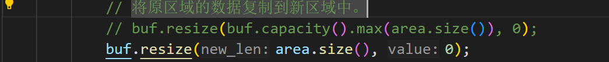

# 第二周

## 本地运行测试

## 线上平台

## 运行所有basic测例

结果见[2025-3-1](../日报/2025-3-1.md)

## 通过clone、fork、wait、exit、waitpid、yield

在原来的代码中，buf的长度会比area的size大，读取的时候会超出该area产生BadAddress错误

详情见[2025-3-3](../日报/2025-3-3.md)