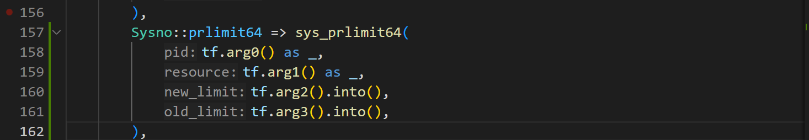

# prlimit64实现

增加syscall



在ctype中加入参数
```rust
/// sys_prlimit64 使用的数组
#[repr(C)]
#[derive(Debug, Copy, Clone)]
pub struct RLimit {
    pub rlim_cur: u64, // 当前软限制
    pub rlim_max: u64, // 最大硬限制
}
// sys_prlimit64 使用的选项
/// 用户栈大小
pub const RLIMIT_STACK: i32 = 3;
/// 可以打开的 fd 数
pub const RLIMIT_NOFILE: i32 = 7;
/// 用户地址空间的最大大小
pub const RLIMIT_AS: i32 = 9;
```


实现(目前只尝试STACK_SIZE)
```rust
#[apply(syscall_instrument)]
pub fn sys_prlimit64(
    pid: i32,
    resource: i32,
    new_limit: UserConstPtr<RLimit>,
    old_limit: UserPtr<RLimit>,
) -> LinuxResult<isize> {
    // 检查资源类型是否有效
    // let curr_process = current().task_ext_mut();
    let curr_process = current();
    let task_ext = curr_process.task_ext();
    if pid == 0 || pid == task_ext.proc_id as i32 {
        // 仅支持当前进程
        match resource {
            // RLIMIT_AS => {
            //     let new_limit = new_limit.get()?;
            //     let old_limit = old_limit.get_mut()?;
            //     let old_limit = curr_process.task_ext().set_rlimit(RLIMIT_AS, new_limit, old_limit);
            //     Ok(0)
            // }
            RLIMIT_STACK => {
                let new_limit = new_limit.get()?;
                let old_limit = old_limit.get()?;
                // let old_limit = curr_process.task_ext().set_rlimit(RLIMIT_STACK, new_limit, old_limit);
                // Ok(0)
                // let mut stack_limit = curr_process
                let mut stack_limit: u64 = task_ext.get_stack_size();
                if old_limit as usize != 0 {
                    unsafe {
                        *old_limit = RLimit {
                            rlim_cur: stack_limit,
                            rlim_max: stack_limit,
                        };
                    }
                }
                if new_limit as usize != 0 {
                    stack_limit = unsafe {
                        (*new_limit).rlim_cur
                    };
                    task_ext.set_stack_size(stack_limit);
                }
            }
            // RLIMIT_NOFILE => {
            //     let new_limit = new_limit.get()?;
            //     let old_limit = old_limit.get_mut()?;
            //     let old_limit = curr_process.task_ext().set_rlimit(RLIMIT_NOFILE, new_limit, old_limit);
            //     Ok(0)
            // }
            // _ => Err(LinuxError::EINVAL),
            _=> { }
        }
    } else {
        return Err(LinuxError::EINVAL);
    }

    Ok(0)
}
```

