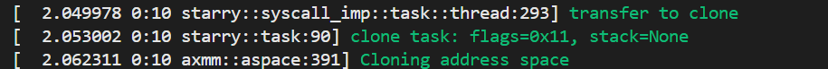
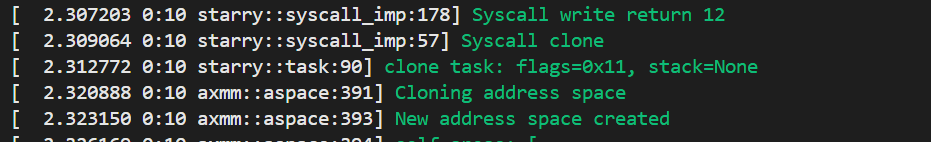

尝试通过对比解决x86_64下argv不能通过（即实现fork系统调用）中出现的page_fault问题无果

已知basic中fork.c测例将fork转为clone


strace结果

```shell
execve("/usr/bin/ls", ["ls", "./musl/basic/fork"], 0x7ffe3ec65a38 /* 41 vars */) = 0
brk(NULL)                               = 0x55c1f95c9000
mmap(NULL, 8192, PROT_READ|PROT_WRITE, MAP_PRIVATE|MAP_ANONYMOUS, -1, 0) = 0x7fc35d70f000
access("/etc/ld.so.preload", R_OK)      = -1 ENOENT (No such file or directory)
openat(AT_FDCWD, "/etc/ld.so.cache", O_RDONLY|O_CLOEXEC) = 3
fstat(3, {st_mode=S_IFREG|0644, st_size=24831, ...}) = 0
mmap(NULL, 24831, PROT_READ, MAP_PRIVATE, 3, 0) = 0x7fc35d708000
close(3)                                = 0
openat(AT_FDCWD, "/lib/x86_64-linux-gnu/libselinux.so.1", O_RDONLY|O_CLOEXEC) = 3
read(3, "\177ELF\2\1\1\0\0\0\0\0\0\0\0\0\3\0>\0\1\0\0\0\0\0\0\0\0\0\0\0"..., 832) = 832
fstat(3, {st_mode=S_IFREG|0644, st_size=174472, ...}) = 0
mmap(NULL, 181960, PROT_READ, MAP_PRIVATE|MAP_DENYWRITE, 3, 0) = 0x7fc35d6db000
mmap(0x7fc35d6e1000, 118784, PROT_READ|PROT_EXEC, MAP_PRIVATE|MAP_FIXED|MAP_DENYWRITE, 3, 0x6000) = 0x7fc35d6e1000
mmap(0x7fc35d6fe000, 24576, PROT_READ, MAP_PRIVATE|MAP_FIXED|MAP_DENYWRITE, 3, 0x23000) = 0x7fc35d6fe000
mmap(0x7fc35d704000, 8192, PROT_READ|PROT_WRITE, MAP_PRIVATE|MAP_FIXED|MAP_DENYWRITE, 3, 0x29000) = 0x7fc35d704000
mmap(0x7fc35d706000, 5832, PROT_READ|PROT_WRITE, MAP_PRIVATE|MAP_FIXED|MAP_ANONYMOUS, -1, 0) = 0x7fc35d706000
close(3)                                = 0
openat(AT_FDCWD, "/lib/x86_64-linux-gnu/libc.so.6", O_RDONLY|O_CLOEXEC) = 3
read(3, "\177ELF\2\1\1\3\0\0\0\0\0\0\0\0\3\0>\0\1\0\0\0\220\243\2\0\0\0\0\0"..., 832) = 832
pread64(3, "\6\0\0\0\4\0\0\0@\0\0\0\0\0\0\0@\0\0\0\0\0\0\0@\0\0\0\0\0\0\0"..., 784, 64) = 784
fstat(3, {st_mode=S_IFREG|0755, st_size=2125328, ...}) = 0
pread64(3, "\6\0\0\0\4\0\0\0@\0\0\0\0\0\0\0@\0\0\0\0\0\0\0@\0\0\0\0\0\0\0"..., 784, 64) = 784
mmap(NULL, 2170256, PROT_READ, MAP_PRIVATE|MAP_DENYWRITE, 3, 0) = 0x7fc35d4c9000
mmap(0x7fc35d4f1000, 1605632, PROT_READ|PROT_EXEC, MAP_PRIVATE|MAP_FIXED|MAP_DENYWRITE, 3, 0x28000) = 0x7fc35d4f1000
mmap(0x7fc35d679000, 323584, PROT_READ, MAP_PRIVATE|MAP_FIXED|MAP_DENYWRITE, 3, 0x1b0000) = 0x7fc35d679000
mmap(0x7fc35d6c8000, 24576, PROT_READ|PROT_WRITE, MAP_PRIVATE|MAP_FIXED|MAP_DENYWRITE, 3, 0x1fe000) = 0x7fc35d6c8000
mmap(0x7fc35d6ce000, 52624, PROT_READ|PROT_WRITE, MAP_PRIVATE|MAP_FIXED|MAP_ANONYMOUS, -1, 0) = 0x7fc35d6ce000
close(3)                                = 0
openat(AT_FDCWD, "/lib/x86_64-linux-gnu/libpcre2-8.so.0", O_RDONLY|O_CLOEXEC) = 3
read(3, "\177ELF\2\1\1\0\0\0\0\0\0\0\0\0\3\0>\0\1\0\0\0\0\0\0\0\0\0\0\0"..., 832) = 832
fstat(3, {st_mode=S_IFREG|0644, st_size=625344, ...}) = 0
mmap(NULL, 627472, PROT_READ, MAP_PRIVATE|MAP_DENYWRITE, 3, 0) = 0x7fc35d42f000
mmap(0x7fc35d431000, 450560, PROT_READ|PROT_EXEC, MAP_PRIVATE|MAP_FIXED|MAP_DENYWRITE, 3, 0x2000) = 0x7fc35d431000
mmap(0x7fc35d49f000, 163840, PROT_READ, MAP_PRIVATE|MAP_FIXED|MAP_DENYWRITE, 3, 0x70000) = 0x7fc35d49f000
mmap(0x7fc35d4c7000, 8192, PROT_READ|PROT_WRITE, MAP_PRIVATE|MAP_FIXED|MAP_DENYWRITE, 3, 0x97000) = 0x7fc35d4c7000
close(3)                                = 0
mmap(NULL, 12288, PROT_READ|PROT_WRITE, MAP_PRIVATE|MAP_ANONYMOUS, -1, 0) = 0x7fc35d42c000
arch_prctl(ARCH_SET_FS, 0x7fc35d42c800) = 0
set_tid_address(0x7fc35d42cad0)         = 286255
set_robust_list(0x7fc35d42cae0, 24)     = 0
rseq(0x7fc35d42d120, 0x20, 0, 0x53053053) = 0
mprotect(0x7fc35d6c8000, 16384, PROT_READ) = 0
mprotect(0x7fc35d4c7000, 4096, PROT_READ) = 0
mprotect(0x7fc35d704000, 4096, PROT_READ) = 0
mprotect(0x55c1f87ae000, 8192, PROT_READ) = 0
mprotect(0x7fc35d747000, 8192, PROT_READ) = 0
prlimit64(0, RLIMIT_STACK, NULL, {rlim_cur=8192*1024, rlim_max=RLIM64_INFINITY}) = 0
munmap(0x7fc35d708000, 24831)           = 0
statfs("/sys/fs/selinux", 0x7fffdf624ce0) = -1 ENOENT (No such file or directory)
statfs("/selinux", 0x7fffdf624ce0)      = -1 ENOENT (No such file or directory)
getrandom("\xc9\x9a\xdf\x9d\x39\x91\x2b\x86", 8, GRND_NONBLOCK) = 8
brk(NULL)                               = 0x55c1f95c9000
brk(0x55c1f95ea000)                     = 0x55c1f95ea000
openat(AT_FDCWD, "/proc/filesystems", O_RDONLY|O_CLOEXEC) = 3
fstat(3, {st_mode=S_IFREG|0444, st_size=0, ...}) = 0
read(3, "nodev\tsysfs\nnodev\ttmpfs\nnodev\tbd"..., 1024) = 478
read(3, "", 1024)                       = 0
close(3)                                = 0
access("/etc/selinux/config", F_OK)     = -1 ENOENT (No such file or directory)
openat(AT_FDCWD, "/usr/lib/locale/locale-archive", O_RDONLY|O_CLOEXEC) = -1 ENOENT (No such file or directory)
openat(AT_FDCWD, "/usr/share/locale/locale.alias", O_RDONLY|O_CLOEXEC) = 3
fstat(3, {st_mode=S_IFREG|0644, st_size=2996, ...}) = 0
read(3, "# Locale name alias data base.\n#"..., 4096) = 2996
read(3, "", 4096)                       = 0
close(3)                                = 0
openat(AT_FDCWD, "/usr/lib/locale/C.UTF-8/LC_IDENTIFICATION", O_RDONLY|O_CLOEXEC) = -1 ENOENT (No such file or directory)
openat(AT_FDCWD, "/usr/lib/locale/C.utf8/LC_IDENTIFICATION", O_RDONLY|O_CLOEXEC) = 3
fstat(3, {st_mode=S_IFREG|0644, st_size=258, ...}) = 0
mmap(NULL, 258, PROT_READ, MAP_PRIVATE, 3, 0) = 0x7fc35d70e000
close(3)                                = 0
openat(AT_FDCWD, "/usr/lib/x86_64-linux-gnu/gconv/gconv-modules.cache", O_RDONLY|O_CLOEXEC) = 3
fstat(3, {st_mode=S_IFREG|0644, st_size=27028, ...}) = 0
mmap(NULL, 27028, PROT_READ, MAP_SHARED, 3, 0) = 0x7fc35d425000
close(3)                                = 0
futex(0x7fc35d6cd72c, FUTEX_WAKE_PRIVATE, 2147483647) = 0
openat(AT_FDCWD, "/usr/lib/locale/C.UTF-8/LC_MEASUREMENT", O_RDONLY|O_CLOEXEC) = -1 ENOENT (No such file or directory)
openat(AT_FDCWD, "/usr/lib/locale/C.utf8/LC_MEASUREMENT", O_RDONLY|O_CLOEXEC) = 3
fstat(3, {st_mode=S_IFREG|0644, st_size=23, ...}) = 0
mmap(NULL, 23, PROT_READ, MAP_PRIVATE, 3, 0) = 0x7fc35d70d000
close(3)                                = 0
openat(AT_FDCWD, "/usr/lib/locale/C.UTF-8/LC_TELEPHONE", O_RDONLY|O_CLOEXEC) = -1 ENOENT (No such file or directory)
openat(AT_FDCWD, "/usr/lib/locale/C.utf8/LC_TELEPHONE", O_RDONLY|O_CLOEXEC) = 3
fstat(3, {st_mode=S_IFREG|0644, st_size=47, ...}) = 0
mmap(NULL, 47, PROT_READ, MAP_PRIVATE, 3, 0) = 0x7fc35d70c000
close(3)                                = 0
openat(AT_FDCWD, "/usr/lib/locale/C.UTF-8/LC_ADDRESS", O_RDONLY|O_CLOEXEC) = -1 ENOENT (No such file or directory)
openat(AT_FDCWD, "/usr/lib/locale/C.utf8/LC_ADDRESS", O_RDONLY|O_CLOEXEC) = 3
fstat(3, {st_mode=S_IFREG|0644, st_size=127, ...}) = 0
mmap(NULL, 127, PROT_READ, MAP_PRIVATE, 3, 0) = 0x7fc35d70b000
close(3)                                = 0
openat(AT_FDCWD, "/usr/lib/locale/C.UTF-8/LC_NAME", O_RDONLY|O_CLOEXEC) = -1 ENOENT (No such file or directory)
openat(AT_FDCWD, "/usr/lib/locale/C.utf8/LC_NAME", O_RDONLY|O_CLOEXEC) = 3
fstat(3, {st_mode=S_IFREG|0644, st_size=62, ...}) = 0
mmap(NULL, 62, PROT_READ, MAP_PRIVATE, 3, 0) = 0x7fc35d70a000
close(3)                                = 0
openat(AT_FDCWD, "/usr/lib/locale/C.UTF-8/LC_PAPER", O_RDONLY|O_CLOEXEC) = -1 ENOENT (No such file or directory)
openat(AT_FDCWD, "/usr/lib/locale/C.utf8/LC_PAPER", O_RDONLY|O_CLOEXEC) = 3
fstat(3, {st_mode=S_IFREG|0644, st_size=34, ...}) = 0
mmap(NULL, 34, PROT_READ, MAP_PRIVATE, 3, 0) = 0x7fc35d709000
close(3)                                = 0
openat(AT_FDCWD, "/usr/lib/locale/C.UTF-8/LC_MESSAGES", O_RDONLY|O_CLOEXEC) = -1 ENOENT (No such file or directory)
openat(AT_FDCWD, "/usr/lib/locale/C.utf8/LC_MESSAGES", O_RDONLY|O_CLOEXEC) = 3
fstat(3, {st_mode=S_IFDIR|0755, st_size=4096, ...}) = 0
close(3)                                = 0
openat(AT_FDCWD, "/usr/lib/locale/C.utf8/LC_MESSAGES/SYS_LC_MESSAGES", O_RDONLY|O_CLOEXEC) = 3
fstat(3, {st_mode=S_IFREG|0644, st_size=48, ...}) = 0
mmap(NULL, 48, PROT_READ, MAP_PRIVATE, 3, 0) = 0x7fc35d708000
close(3)                                = 0
openat(AT_FDCWD, "/usr/lib/locale/C.UTF-8/LC_MONETARY", O_RDONLY|O_CLOEXEC) = -1 ENOENT (No such file or directory)
openat(AT_FDCWD, "/usr/lib/locale/C.utf8/LC_MONETARY", O_RDONLY|O_CLOEXEC) = 3
fstat(3, {st_mode=S_IFREG|0644, st_size=270, ...}) = 0
mmap(NULL, 270, PROT_READ, MAP_PRIVATE, 3, 0) = 0x7fc35d424000
close(3)                                = 0
openat(AT_FDCWD, "/usr/lib/locale/C.UTF-8/LC_COLLATE", O_RDONLY|O_CLOEXEC) = -1 ENOENT (No such file or directory)
openat(AT_FDCWD, "/usr/lib/locale/C.utf8/LC_COLLATE", O_RDONLY|O_CLOEXEC) = 3
fstat(3, {st_mode=S_IFREG|0644, st_size=1406, ...}) = 0
mmap(NULL, 1406, PROT_READ, MAP_PRIVATE, 3, 0) = 0x7fc35d423000
close(3)                                = 0
openat(AT_FDCWD, "/usr/lib/locale/C.UTF-8/LC_TIME", O_RDONLY|O_CLOEXEC) = -1 ENOENT (No such file or directory)
openat(AT_FDCWD, "/usr/lib/locale/C.utf8/LC_TIME", O_RDONLY|O_CLOEXEC) = 3
fstat(3, {st_mode=S_IFREG|0644, st_size=3360, ...}) = 0
mmap(NULL, 3360, PROT_READ, MAP_PRIVATE, 3, 0) = 0x7fc35d422000
close(3)                                = 0
openat(AT_FDCWD, "/usr/lib/locale/C.UTF-8/LC_NUMERIC", O_RDONLY|O_CLOEXEC) = -1 ENOENT (No such file or directory)
openat(AT_FDCWD, "/usr/lib/locale/C.utf8/LC_NUMERIC", O_RDONLY|O_CLOEXEC) = 3
fstat(3, {st_mode=S_IFREG|0644, st_size=50, ...}) = 0
mmap(NULL, 50, PROT_READ, MAP_PRIVATE, 3, 0) = 0x7fc35d421000
close(3)                                = 0
openat(AT_FDCWD, "/usr/lib/locale/C.UTF-8/LC_CTYPE", O_RDONLY|O_CLOEXEC) = -1 ENOENT (No such file or directory)
openat(AT_FDCWD, "/usr/lib/locale/C.utf8/LC_CTYPE", O_RDONLY|O_CLOEXEC) = 3
fstat(3, {st_mode=S_IFREG|0644, st_size=360460, ...}) = 0
mmap(NULL, 360460, PROT_READ, MAP_PRIVATE, 3, 0) = 0x7fc35d3c8000
close(3)                                = 0
ioctl(1, TCGETS, {c_iflag=BRKINT|ICRNL|IXON|IXANY|IMAXBEL|IUTF8, c_oflag=NL0|CR0|TAB0|BS0|VT0|FF0|OPOST|ONLCR, c_cflag=B38400|CS8|CREAD|HUPCL, c_lflag=ISIG|ICANON|ECHO|ECHOE|ECHOK|IEXTEN|ECHOCTL|ECHOKE, ...}) = 0
ioctl(1, TIOCGWINSZ, {ws_row=16, ws_col=126, ws_xpixel=0, ws_ypixel=0}) = 0
statx(AT_FDCWD, "./musl/basic/fork", AT_STATX_SYNC_AS_STAT|AT_NO_AUTOMOUNT, STATX_MODE, 0x7fffdf6247c0) = -1 ENOENT (No such file or directory)
statx(AT_FDCWD, "./musl/basic/fork", AT_STATX_SYNC_AS_STAT|AT_SYMLINK_NOFOLLOW|AT_NO_AUTOMOUNT, STATX_MODE, 0x7fffdf6247c0) = -1 ENOENT (No such file or directory)
write(2, "ls: ", 4ls: )                     = 4
write(2, "cannot access './musl/basic/fork"..., 33cannot access './musl/basic/fork') = 33
write(2, ": No such file or directory", 27: No such file or directory) = 27
write(2, "\n", 1
)                       = 1
close(1)                                = 0
close(2)                                = 0
exit_group(2)                           = ?
+++ exited with 2 +++
```

argv


fork
