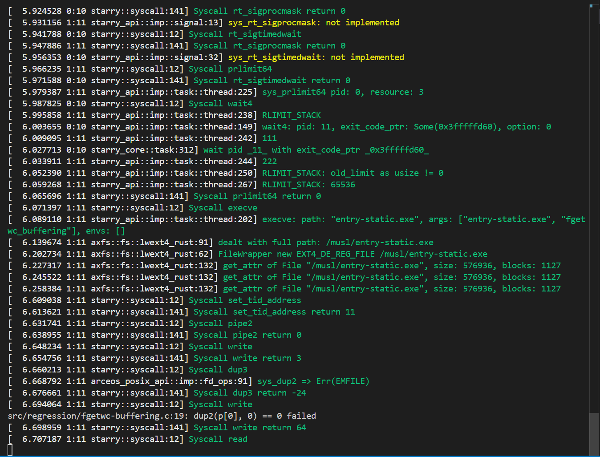
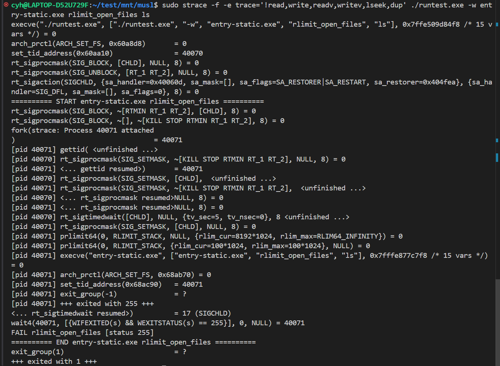

# 增加libctest的测例，对未通过的测例进行分析

musl entry-static.exe fdopen lseek 移动文件指针
musl entry-static.exe fscanf lseek
musl entry-static.exe fwscanf unknown
musl entry-static.exe pthread_cancel_points points 0/1 futex
musl entry-static.exe pthread_cancel points 0/1 futex
musl entry-static.exe pthread_cond points 0/1 futex
musl entry-static.exe pthread_tsd points 0/1 futex
musl entry-static.exe setjmp points 0/1 src/functional/setjmp.c:62: sigismember(&set2, SIGUSR1)==1 failed: siglongjmp incorrectly restored mask
musl entry-static.exe socket points 0/1
musl entry-static.exe sscanf points 0/1 ioctl
musl entry-static.exe sscanf_long points 0/1
musl entry-static.exe stat points 0/1 ioctl
musl entry-static.exe ungetc points 0/1 ioctl
musl entry-static.exe utime points 0/1 utimesetat
musl entry-static.exe lseek_large points 0/1 ioctl
musl entry-static.exe pthread_robust_detach points 0/1 futex
musl entry-static.exe pthread_cancel_sem_wait points 0/1 futex
musl entry-static.exe pthread_cond_smasher points 0/1 futex
musl entry-static.exe pthread_condattr_setclock points 0/1 futex
musl entry-static.exe pthread_exit_cancel points 0/1 futex
musl entry-static.exe pthread_once_deadlock points 0/1 futex
musl entry-static.exe pthread_rwlock_ebusy points 0/1 futex
musl entry-static.exe rewind_clear_error points 0/1 unknown
musl entry-static.exe rlimit_open_files points 0/1 dup无限增长->prlimit64? 
musl entry-static.exe setvbuf_unget points 0/1 lseek
musl entry-static.exe statvfs points 0/1 statfs 
/musl/runtest.exe -w entry-static.exe fflush_exit pread64
/musl/runtest.exe -w entry-static.exe daemon_failure dup无限增长->prlimit64? 
/musl/runtest.exe -w entry-static.exe fgetwc_buffering

/musl/runtest.exe -w entry-static.exe ftello_unflushed_append kill

## rlimit_open_files

简单使用strace无法通过，应该是用到了文件系统的原因，需要进一步分析。

```shell
34142 set_tid_address(0x1d238) = 34142
34142 rt_sigprocmask(SIG_BLOCK,0x00002aaaab2aa580,NULL,8) = 0
34142 rt_sigprocmask(SIG_UNBLOCK,0x00002aaaab2aa3c0,NULL,8) = 0
34142 rt_sigaction(SIGCHLD,0x00002aaaab2aa3a0,0x00002aaaab2aa3c0) = 0
34142 write(1,0xab2aa310,63)========== START entry-static.exe rlimit_open_files ==========
 = 63
34142 rt_sigprocmask(SIG_BLOCK,0x000000000001d160,0x00002aaaab2aa4d0,8) = 0
34142 clone(0x11,child_stack=0x0000000000000000,parent_tidptr=0x00002aaaab2aa4d0,tls=0x0000000000000008,child_tidptr=0x0000000000000000) = 34144
 = 0
34142 rt_sigprocmask(SIG_SETMASK,0x00002aaaab2aa4d0,NULL,8) = 0
34144 gettid() = 34144
34142 rt_sigtimedwait(46912504505728,0,46912504505712,8,0,0)34144 rt_sigprocmask(SIG_SETMASK,0x00002aaaab2aa4d0,NULL,8) = 0
34144 prlimit64(0,RLIMIT_STACK,NULL,0x00002aaaab2aa530) = 0 ({rlim_cur=8388608,rlim_max=-1})
34144 rt_sigprocmask(SIG_BLOCK,0x000000000001d168,0x00002aaaab2aa398,8) = 0
34144 rt_sigprocmask(SIG_BLOCK,0x000000000001d160,NULL,8) = 0
34144 prlimit64(0,RLIMIT_STACK,{rlim_cur=102400,rlim_max=102400},NULL) = 0
34144 rt_sigprocmask(SIG_SETMASK,0x00002aaaab2aa398,NULL,8) = 0
34144 execve("entry-static.exe",{"entry-static.exe","rlimit_open_files","ls",NULL}) = -1 errno=8 (Exec format error)
34144 write(1,0xab2aa310,73)src/common/runtest.c:29: entry-static.exe exec failed: Exec format error
 = 73
34144 exit_group(1)
 = 17
34142 wait4(34144,0x2aaaab2aa570,0,(nil)) = 34144
34142 write(1,0xab2aa310,34)FAIL rlimit_open_files [status 1]
 = 34
34142 write(1,0xab2aa310,61)========== END entry-static.exe rlimit_open_files ==========
 = 61
34142 exit_group(1)
```

```shell
execve("./runtest.exe", ["./runtest.exe", "entry-static.exe", "rlimit_open_files", "ls"], 0x7ffdc60a2e60 /* 15 vars */) = 0
arch_prctl(ARCH_SET_FS, 0x60a8d8)       = 0
set_tid_address(0x60aa10)               = 39496
rt_sigprocmask(SIG_BLOCK, [CHLD], NULL, 8) = 0
rt_sigprocmask(SIG_UNBLOCK, [RT_1 RT_2], NULL, 8) = 0
rt_sigaction(SIGCHLD, {sa_handler=0x40060d, sa_mask=[], sa_flags=SA_RESTORER|SA_RESTART, sa_restorer=0x404fea}, {sa_handler=SIG_DFL, sa_mask=[], sa_flags=0}, 8) = 0
========== START  entry-static.exe ==========
rt_sigprocmask(SIG_BLOCK, ~[RTMIN RT_1 RT_2], [CHLD], 8) = 0
rt_sigprocmask(SIG_BLOCK, ~[], ~[KILL STOP RTMIN RT_1 RT_2], 8) = 0
fork(strace: Process 39497 attached
)                                  = 39497
[pid 39497] gettid( <unfinished ...>
[pid 39496] rt_sigprocmask(SIG_SETMASK, ~[KILL STOP RTMIN RT_1 RT_2],  <unfinished ...>
[pid 39497] <... gettid resumed>)       = 39497
[pid 39496] <... rt_sigprocmask resumed>NULL, 8) = 0
[pid 39496] rt_sigprocmask(SIG_SETMASK, [CHLD],  <unfinished ...>
[pid 39497] rt_sigprocmask(SIG_SETMASK, ~[KILL STOP RTMIN RT_1 RT_2],  <unfinished ...>
[pid 39496] <... rt_sigprocmask resumed>NULL, 8) = 0
[pid 39497] <... rt_sigprocmask resumed>NULL, 8) = 0
[pid 39496] rt_sigtimedwait([CHLD], NULL, {tv_sec=5, tv_nsec=0}, 8 <unfinished ...>
[pid 39497] rt_sigprocmask(SIG_SETMASK, [CHLD], NULL, 8) = 0
[pid 39497] prlimit64(0, RLIMIT_STACK, NULL, {rlim_cur=8192*1024, rlim_max=RLIM64_INFINITY}) = 0
[pid 39497] prlimit64(0, RLIMIT_STACK, {rlim_cur=100*1024, rlim_max=100*1024}, NULL) = 0
[pid 39497] execve("entry-static.exe", ["entry-static.exe", "rlimit_open_files", "ls"], 0x7ffd14c34100 /* 15 vars */) = 0
[pid 39497] arch_prctl(ARCH_SET_FS, 0x68ab70) = 0
[pid 39497] set_tid_address(0x68ac90)   = 39497
[pid 39497] exit_group(-1)              = ?
[pid 39497] +++ exited with 255 +++
<... rt_sigtimedwait resumed>)          = 17 (SIGCHLD)
wait4(39497, [{WIFEXITED(s) && WEXITSTATUS(s) == 255}], 0, NULL) = 39497
FAIL entry-static.exe [status 255]
========== END  entry-static.exe ==========
exit_group(1)                           = ?
+++ exited with 1 +++
```

