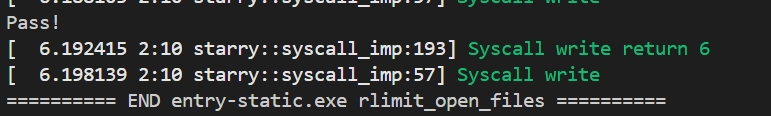

## 通过rlimit_open_files测例

此次本想仿照starry-old编写fd_manager，但由于中途发现工作量过大，且与arceos有一定重合，因而采用比较取巧的方式

1. 为taskext添加文件数量限制，初始化为AX_FILE_LIMIT（1024），和arceos保持一致
2. 修改sys_dup当返回的fd大于限制时，close该fd，返回错误码

## 实现sysinfo
sysinfo函数用于获取系统信息，包括系统名称、节点名称、发行版本、版本号、机器ID和处理器类型。