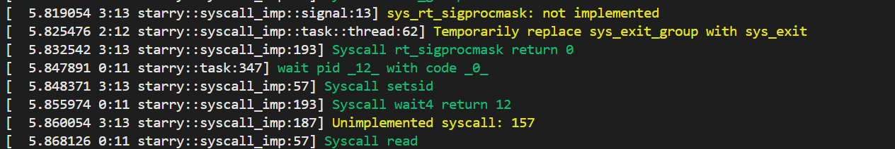

## daemon_failure测例
初始情况
```shell
========== START entry-static.exe daemon_failure ==========
[  5.077741 0:10 starry::syscall_imp:193] Syscall write return 60
[  5.082398 0:10 starry::syscall_imp:57] Syscall rt_sigprocmask
[  5.086467 0:10 starry::syscall_imp::signal:13] sys_rt_sigprocmask: not implemented
[  5.090697 0:10 starry::syscall_imp:193] Syscall rt_sigprocmask return 0
[  5.095741 0:10 starry::syscall_imp:57] Syscall clone
[  5.150826 0:10 starry::syscall_imp:193] Syscall clone return 11
[  5.156002 0:10 starry::syscall_imp:57] Syscall rt_sigprocmask
[  5.160328 0:10 starry::syscall_imp::signal:13] sys_rt_sigprocmask: not implemented
[  5.158070 1:11 starry::task:99] Enter user space: entry=0x1326c, ustack=0x3fffffcc0, kstack=VA:0xffffffc080c10070
[  5.167447 0:10 starry::syscall_imp:193] Syscall rt_sigprocmask return 0
[  5.179796 1:11 starry::syscall_imp:57] Syscall gettid
[  5.185995 0:10 starry::syscall_imp:57] Syscall rt_sigtimedwait
[  5.189692 1:11 starry::syscall_imp:193] Syscall gettid return 11
[  5.195464 0:10 starry::syscall_imp::signal:33] sys_rt_sigaction: not implemented
[  5.202598 1:11 starry::syscall_imp:57] Syscall rt_sigprocmask
[  5.207858 0:10 starry::syscall_imp:193] Syscall rt_sigtimedwait return 0
[  5.214361 1:11 starry::syscall_imp::signal:13] sys_rt_sigprocmask: not implemented
[  5.224031 0:10 starry::syscall_imp:57] Syscall wait4
[  5.229438 1:11 starry::syscall_imp:193] Syscall rt_sigprocmask return 0
[  5.243623 1:11 starry::syscall_imp:57] Syscall prlimit64
[  5.248041 1:11 starry::syscall_imp::task::thread:223] sys_prlimit64 pid: 0, resource: 3
[  5.254630 1:11 starry::syscall_imp::task::thread:239] RLIMIT_STACK
[  5.258764 1:11 starry::syscall_imp::task::thread:247] RLIMIT_STACK: old_limit as usize != 0
[  5.264587 1:11 starry::syscall_imp::task::thread:264] RLIMIT_STACK: 65536
[  5.270334 1:11 starry::syscall_imp:193] Syscall prlimit64 return 0
[  5.275926 1:11 starry::syscall_imp:57] Syscall execve
[  5.290642 1:11 starry::syscall_imp::task::thread:199] execve: path: "entry-static.exe", args: ["entry-static.exe", "daemon_failure"], envs: []
[  5.330509 1:11 axfs::fs::lwext4_rust:91] dealt with full path: /musl/entry-static.exe
[  5.373135 1:11 axfs::fs::lwext4_rust:62] FileWrapper new EXT4_DE_REG_FILE /musl/entry-static.exe
[  5.391203 1:11 axfs::fs::lwext4_rust:132] get_attr of File "/musl/entry-static.exe", size: 576936, blocks: 1127
[  5.403782 1:11 axfs::fs::lwext4_rust:132] get_attr of File "/musl/entry-static.exe", size: 576936, blocks: 1127
[  5.412913 1:11 axfs::fs::lwext4_rust:132] get_attr of File "/musl/entry-static.exe", size: 576936, blocks: 1127
[  5.689501 1:11 starry::syscall_imp:57] Syscall set_tid_address
[  5.692956 1:11 starry::syscall_imp:193] Syscall set_tid_address return 11
[  5.701009 1:11 starry::syscall_imp:57] Syscall pipe2
[  5.709320 1:11 starry::syscall_imp:193] Syscall pipe2 return 0
[  5.714331 1:11 starry::syscall_imp:57] Syscall dup
[  5.718124 1:11 starry::syscall_imp:193] Syscall dup return 5
[  5.723099 1:11 starry::syscall_imp:57] Syscall rt_sigprocmask
[  5.727535 1:11 starry::syscall_imp::signal:13] sys_rt_sigprocmask: not implemented
[  5.731536 1:11 starry::syscall_imp:193] Syscall rt_sigprocmask return 0
[  5.736622 1:11 starry::syscall_imp:57] Syscall clone
[  5.755780 1:11 starry::syscall_imp:193] Syscall clone return 12
[  5.760119 1:11 starry::syscall_imp:57] Syscall rt_sigprocmask
[  5.762763 2:12 starry::task:99] Enter user space: entry=0x2ec5c, ustack=0x3fffffd70, kstack=VA:0xffffffc080c50090
[  5.764253 1:11 starry::syscall_imp::signal:13] sys_rt_sigprocmask: not implemented
[  5.774865 2:12 starry::syscall_imp:57] Syscall gettid
[  5.779675 1:11 starry::syscall_imp:193] Syscall rt_sigprocmask return 0
[  5.785771 2:12 starry::syscall_imp:193] Syscall gettid return 12
[  5.796509 1:11 starry::syscall_imp:57] Syscall close
[  5.799897 2:12 starry::syscall_imp:57] Syscall rt_sigprocmask
[  5.806638 1:11 starry::syscall_imp:193] Syscall close return 0
[  5.808719 2:12 starry::syscall_imp::signal:13] sys_rt_sigprocmask: not implemented
[  5.817129 1:11 starry::syscall_imp:57] Syscall wait4
[  5.821787 2:12 starry::syscall_imp:193] Syscall rt_sigprocmask return 0
[  5.835538 2:12 starry::syscall_imp:57] Syscall dup
[  5.838924 2:12 starry::syscall_imp:193] Syscall dup return 6
[  5.844470 2:12 starry::syscall_imp:57] Syscall dup
[  5.847785 2:12 starry::syscall_imp:193] Syscall dup return 7
[  5.851559 2:12 starry::syscall_imp:57] Syscall dup
[  5.855426 2:12 starry::syscall_imp:193] Syscall dup return 8
[  5.859556 2:12 starry::syscall_imp:57] Syscall dup
[  5.864315 2:12 starry::syscall_imp:193] Syscall dup return 9
[  5.868820 2:12 starry::syscall_imp:57] Syscall dup
[  5.871807 2:12 starry::syscall_imp:193] Syscall dup return 10
[  5.876074 2:12 starry::syscall_imp:57] Syscall dup
[  5.880174 2:12 starry::syscall_imp:193] Syscall dup return 11
[  5.884876 2:12 starry::syscall_imp:57] Syscall dup
[  5.888240 2:12 starry::syscall_imp:193] Syscall dup return 12
[  5.891825 2:12 starry::syscall_imp:57] Syscall dup
[  5.895525 2:12 starry::syscall_imp:193] Syscall dup return 13
[  5.900034 2:12 starry::syscall_imp:57] Syscall dup
[  5.903874 2:12 starry::syscall_imp:193] Syscall dup return 14
[  5.907881 2:12 starry::syscall_imp:57] Syscall dup
[  5.910972 2:12 starry::syscall_imp:193] Syscall dup return 15
[  5.915477 2:12 starry::syscall_imp:57] Syscall dup
[  5.919111 2:12 starry::syscall_imp:193] Syscall dup return 16
[  5.922875 2:12 starry::syscall_imp:57] Syscall dup
[  5.926350 2:12 starry::syscall_imp:193] Syscall dup return 17
[  5.930603 2:12 starry::syscall_imp:57] Syscall dup
[  5.934539 2:12 starry::syscall_imp:193] Syscall dup return 18
[  5.939326 2:12 starry::syscall_imp:57] Syscall dup
[  5.952992 2:12 starry::syscall_imp:193] Syscall dup return 19
[  5.957710 2:12 starry::syscall_imp:57] Syscall dup
[  5.961453 2:12 starry::syscall_imp:193] Syscall dup return 20
[  5.972175 2:12 starry::syscall_imp:57] Syscall dup
[  5.974956 2:12 starry::syscall_imp:193] Syscall dup return 21
[  5.977689 2:12 starry::syscall_imp:57] Syscall dup
[  5.981036 2:12 starry::syscall_imp:193] Syscall dup return 22
[  5.984449 2:12 starry::syscall_imp:57] Syscall dup
[  5.986876 2:12 starry::syscall_imp:193] Syscall dup return 23
[  6.001782 2:12 starry::syscall_imp:57] Syscall dup
[  6.005989 2:12 starry::syscall_imp:193] Syscall dup return 24
[  6.018720 2:12 starry::syscall_imp:57] Syscall dup
[  6.022861 2:12 starry::syscall_imp:193] Syscall dup return 25
[  6.026467 2:12 starry::syscall_imp:57] Syscall dup
[  6.031798 2:12 starry::syscall_imp:193] Syscall dup return 26
[  6.039368 2:12 starry::syscall_imp:57] Syscall dup
[  6.042750 2:12 starry::syscall_imp:193] Syscall dup return 27
[  6.046535 2:12 starry::syscall_imp:57] Syscall dup
[  6.050987 2:12 starry::syscall_imp:193] Syscall dup return 28
[  6.055997 2:12 starry::syscall_imp:57] Syscall dup
[  6.059606 2:12 starry::syscall_imp:193] Syscall dup return 29
[  6.064249 2:12 starry::syscall_imp:57] Syscall dup
[  6.067523 2:12 starry::syscall_imp:193] Syscall dup return 30
[  6.072424 2:12 starry::syscall_imp:57] Syscall dup
[  6.076507 2:12 starry::syscall_imp:193] Syscall dup return 31
[  6.080750 2:12 starry::syscall_imp:57] Syscall dup
[  6.083908 2:12 starry::syscall_imp:193] Syscall dup return 32
[  6.087438 2:12 starry::syscall_imp:57] Syscall dup
[  6.091865 2:12 starry::syscall_imp:193] Syscall dup return 33
[ 19.425728 2:12 starry::syscall_imp:57] Syscall dup
[ 19.431990 2:12 starry::syscall_imp:193] Syscall dup return 1021
[ 19.440077 2:12 starry::syscall_imp:57] Syscall dup
[ 19.447876 2:12 starry::syscall_imp:193] Syscall dup return 1022
[ 19.456481 2:12 starry::syscall_imp:57] Syscall dup
[ 19.462655 2:12 starry::syscall_imp:193] Syscall dup return 1023
[ 19.471774 2:12 starry::syscall_imp:57] Syscall dup
[ 19.479939 2:12 arceos_posix_api::imp::fd_ops:83] sys_dup => Err(EMFILE)
[ 19.494421 2:12 starry::syscall_imp:193] Syscall dup return -24
[ 19.503132 2:12 starry::syscall_imp:57] Syscall getpid
[ 19.510997 2:12 starry::syscall_imp:193] Syscall getpid return 12
[ 19.520535 2:12 starry::syscall_imp:57] Syscall chdir
[ 19.542304 2:12 starry::syscall_imp:193] Syscall chdir return 0
[ 19.554370 2:12 starry::syscall_imp:57] Syscall openat
[ 19.588572 2:12 arceos_posix_api::imp::fs:131] sys_open => Err(EMFILE)
[ 19.598135 2:12 starry::syscall_imp:193] Syscall openat return -24
[ 19.608286 2:12 starry::syscall_imp:57] Syscall dup3
[ 19.618469 2:12 arceos_posix_api::imp::fd_ops:91] sys_dup2 => Err(EMFILE)
[ 19.629106 2:12 starry::syscall_imp:193] Syscall dup3 return -24
[ 19.638493 2:12 starry::syscall_imp:57] Syscall write
ERROR:
[ 19.647597 2:12 starry::syscall_imp:193] Syscall write return 7
[ 19.693123 2:12 starry::syscall_imp:57] Syscall write
src/regression/daemon-failure.c:47: failed to dup pipe fd for communicating results: No file descriptors available
[ 19.707195 2:12 starry::syscall_imp:193] Syscall write return 115
[ 19.716969 2:12 starry::syscall_imp:57] Syscall getpid
[ 19.723165 2:12 starry::syscall_imp:193] Syscall getpid return 12
[ 19.731547 2:12 starry::syscall_imp:57] Syscall getppid
[ 19.739364 2:12 starry::syscall_imp:193] Syscall getppid return 1
[ 19.747886 2:12 starry::syscall_imp:57] Syscall getppid
[ 19.755052 2:12 starry::syscall_imp:193] Syscall getppid return 1
[ 19.762628 2:12 starry::syscall_imp:57] Syscall getpid
[ 19.769678 2:12 starry::syscall_imp:193] Syscall getpid return 12
[ 19.781738 2:12 starry::syscall_imp:57] Syscall write
src/regression/daemon-failure.c:54: daemon forked despite failure: ppid is 1, pid is 12, old pid is 12
[ 19.796658 2:12 starry::syscall_imp:193] Syscall write return 103
[ 19.806185 2:12 starry::syscall_imp:57] Syscall write
[ 19.814260 2:12 starry::syscall_imp:193] Syscall write return 1
[ 19.829226 2:12 starry::syscall_imp:57] Syscall exit_group
[ 19.837120 2:12 starry::syscall_imp::task::thread:62] Temporarily replace sys_exit_group with sys_exit
[ 19.859833 3:11 starry::task:347] wait pid _12_ with code _1_
[ 19.871395 3:11 starry::syscall_imp:193] Syscall wait4 return 12
[ 19.903871 3:11 starry::syscall_imp:57] Syscall write
src/regression/daemon-failure.c:66: child exited with 1
[ 19.913167 3:11 starry::syscall_imp:193] Syscall write return 56
[ 19.921105 3:11 starry::syscall_imp:57] Syscall read
```

发现dup3系统调用的返回值异常
修改arceos的dup2，close new_fd 之后dup3暂时没问题，但是要通过该测例需要实现setsid系统调用，观察Starry-Old发现其与会话相关，展示搁置
