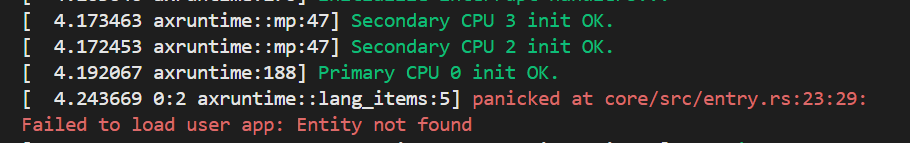
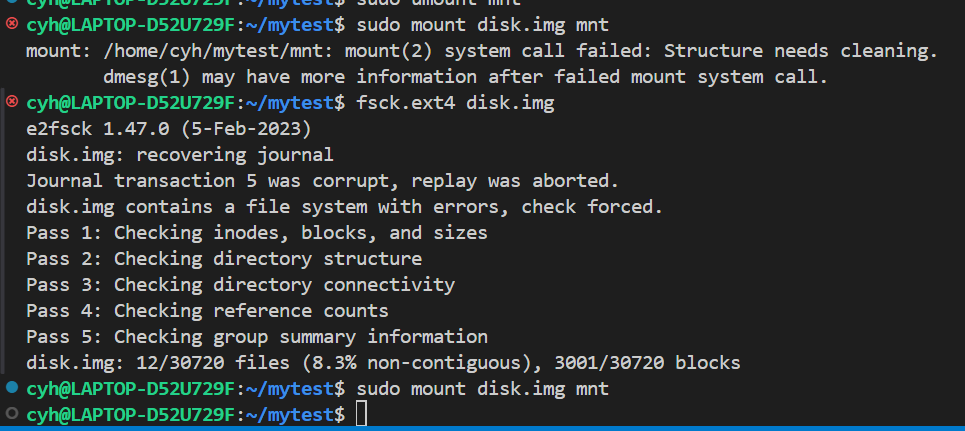
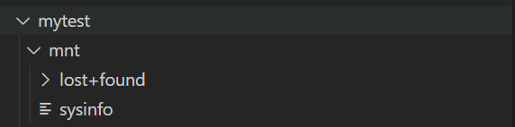

## 完善sysinfo的功能，编写测例

本地运行结果
```shell
cyh@LAPTOP-D52U729F:~/starry-next$ qemu-riscv64 -strace ./apps/tests/build/sysinfo 
41572 set_tid_address(0x55555555e778) = 41572
41572 sysinfo(0x2aaaab2aa500) = 0
41572 ioctl(1,TIOCGWINSZ,0x00002aaaab2aa1d8) = 0 ({18,118,0,0})
41572 writev(1,0x2aaaab2aa180,0x2)System Uptime: 9662 seconds
 = 28
41572 writev(1,0x2aaaab2aa1a0,0x2)Total RAM: 8216678400 KB
 = 25
41572 writev(1,0x2aaaab2aa1a0,0x2)Free RAM: 135815168 KB
 = 23
41572 writev(1,0x2aaaab2aa1a0,0x2)Shared RAM: 2736128 KB
 = 23
41572 writev(1,0x2aaaab2aa1a0,0x2)Buffer RAM: 41385984 KB
 = 24
41572 writev(1,0x2aaaab2aa1a0,0x2)Total Swap: 2147483648 KB
 = 26
41572 writev(1,0x2aaaab2aa1a0,0x2)Free Swap: 516263936 KB
 = 24
41572 writev(1,0x2aaaab2aa1a0,0x2)Number of Processors: 402
 = 26
41572 writev(1,0x2aaaab2aa1a0,0x2)Total High Memory: 0 KB
 = 24
41572 writev(1,0x2aaaab2aa1a0,0x2)Free High Memory: 0 KB
 = 23
41572 writev(1,0x2aaaab2aa1a0,0x2)Memory Unit Size: 1 bytes
 = 26
41572 exit_group(0)
```

遇到问题——找不到应用程序






但是使用相同的方法运行之前编写的prlimit64的测例却可以正常运行